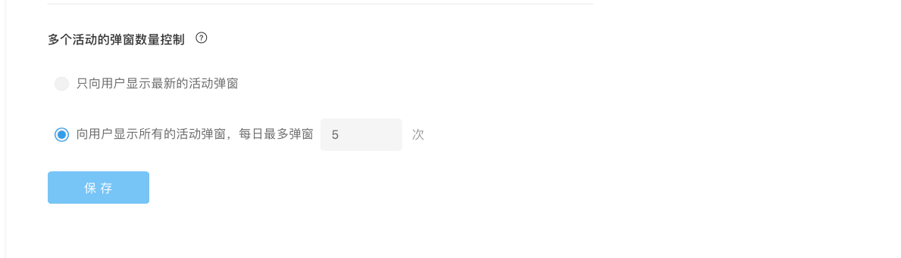

# 创建微信小程序活动的FAQ

## 1.支持哪些类型的小程序接入？

* 已上线小程序
* 开发中小程序
* 第三方生成的小程序（小程序需适应SDK集成）

## 2.当弹窗活动处于运行状态时，能否进行修改？

需要将正在运行的弹窗活动先暂停，再进行修改。暂停活动后，进入活动列表页面，点击“编辑”按钮进入该活动编辑页面进行修改，修改完成并通过测试后重新开始弹窗活动。

## 3.当修改过的弹窗活动上线后，已触达的用户是否会再次收到弹窗？

目前会再次收到。

## 4.小程序弹窗支持跳转至哪些页面？

目前仅支持跳转至该小程序内部页面。

## 5.当同一用户满足多个弹窗条件时，如何进行优先级处理？

小程序弹窗的优先级按照更新时间排序。当同一个用户满足多个目标人群条件，且其他弹窗触发条件相同时，不会在同一时间向该用户推送多个小程序弹窗。

可以选择只向用户显示最新的弹窗或向用户显示所有弹窗。当选择只显示最新弹窗时，用户只会在第一次打开小程序并满足触发条件时，收到一个最近更新的弹窗，在后续打开小程序并满足条件时，不会收到其余优先级的弹窗。当选择显示所有弹窗时，用户第一次会收到一个最近更新的弹窗，当用户第二次打开小程序并满足触发条件时，会收到第二优先级的弹窗，以此类推，当达到每日弹窗最大次数时不再向该用户推送弹窗。

