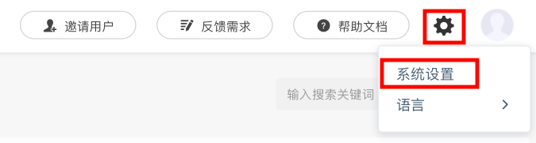

# 扫码绑定微信

授权方式：认证公众号扫码授权接入。

## 一、进入设置界面

用户登录完成后，点击右上角“设置”图标，点击“系统设置”进入设置页面。

## 二、进入扫码界面

点击”微信配置“进入配置页面后，点击”添加“按钮，显示链接后，点击链接跳转到微信公众号授权页面。

## 三、扫码授权

管理员用手机扫描页面上的二维码，手机页面跳转到公众号列表页，选择要授权的公众号。选择授权公众号全部接口，确保消息推送功能全部实现。

