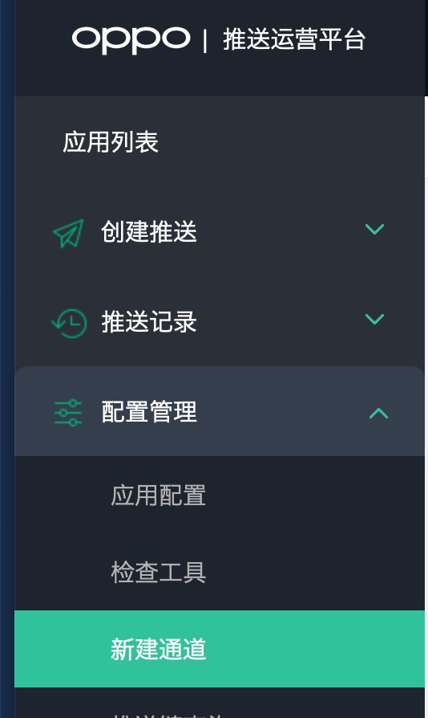
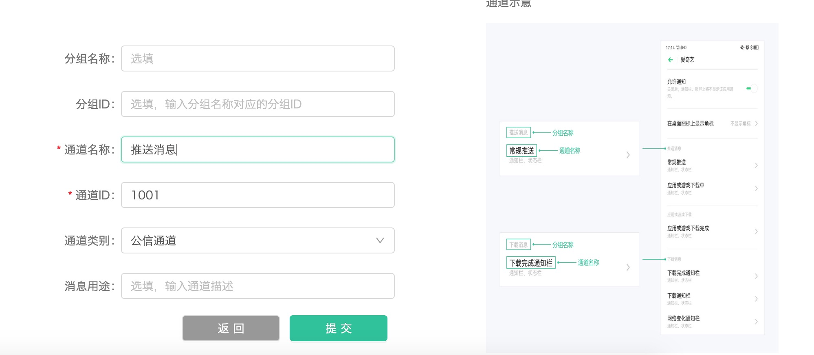
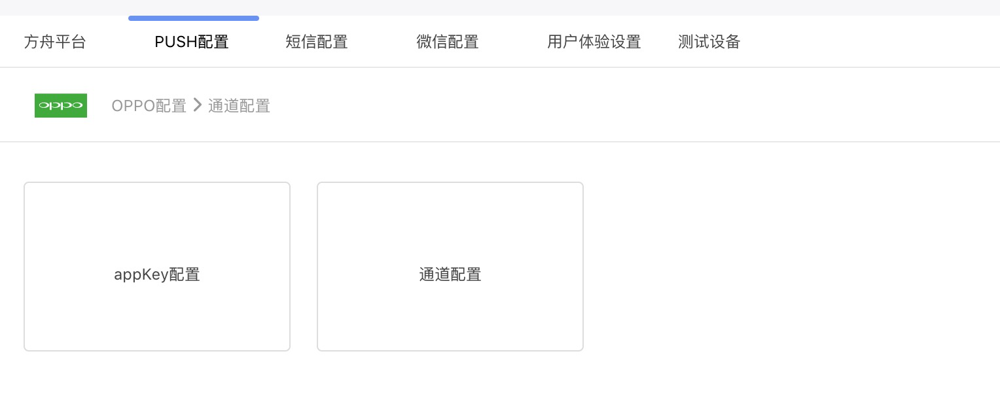
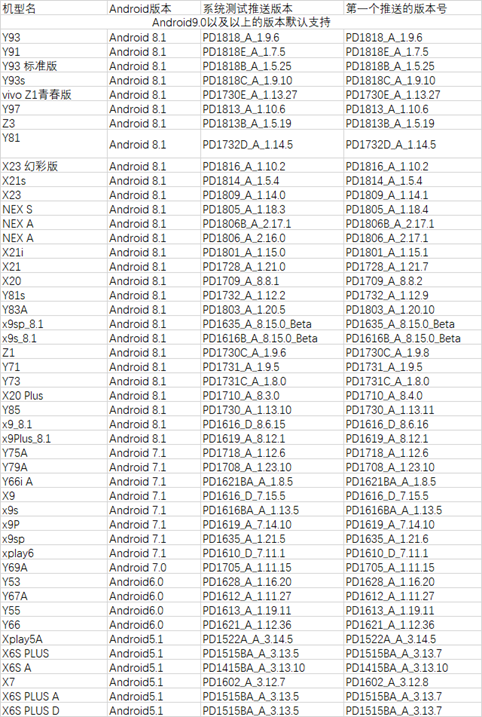

# Android SDK

### 一、SDK简介

EA智能运营系统是易观基于方舟平台设计一款触达用户的产品，加强了产品的用户体验和提升了产品的转化率， EA的android SDK是此系统中重要的支撑点，它提供了：

* 提供触达用户的弹窗功能，支持的弹窗样式： 

1. 图片样式，支持点击事件。
2. 文本样式，支持标题，正文、两个按钮。
3. 图文混合样式，最上面是图片，下面是标题、正文、按钮。
4. H5样式，支持HTML页面，满足用户不用跳转，就可以快速响应用户事件。

* 订阅事件，用户在后台如果创建了基于用户事件的触发行为（弹窗除外），SDK就会在每次启动的时候拉取订阅列表，并在有订阅事件产生的时候通知给EA系统。

### 二、快速开始

为了快速的接入厂商推送通道，我们在方舟的SDK中集成了华为、小米、OPPO、VIOV、魅族厂商推送SDK。如果现在你的应用已经接入了某些厂商的通道，你需要把相关接入代码删除。

#### 1、获取项目AppKey

  在EA系统中选择要集成的项目，并在项目属性中查看项目的appKey，[登录EA系统](https://ea.analysys.cn/app.html#/Login)

#### 2、集成SDK

        在项目根目录的build.gradle中添加如下代码：

```text
buildscript {
    repositories {
        ...
        maven { url 'http://maven.aliyun.com/nexus/content/groups/public/'}
        jcenter { url 'http://maven.aliyun.com/nexus/content/groups/public/' }
        maven { url 'http://developer.huawei.com/repo/' }
    }
    dependencies {
        ...
        classpath 'com.huawei.agconnect:agcp:1.0.0.300'
    }
}
allprojects {
    repositories {
        ...
        //EA SDK的maven地址
        maven { url 'http://maven.aliyun.com/nexus/content/groups/public/'}
        jcenter { url 'http://maven.aliyun.com/nexus/content/groups/public/' }
        maven { url "http://developer.huawei.com/repo/" }
        maven { url "https://jitpack.io" }
    }
}
```

* 集成SDK

        在app的Module的build.gradle中添加如下引用：

```text
dependencies {
//如果已经集成方舟SDK，
//analysys-core的版本要大于4.4.12
implementation 'cn.com.analysys:analysys-core:4.4.12'
//EA push SDK集成了华为、小米、OPPO、VIVO、魅族推送SDK
implementation 'cn.com.analysys:analysys-easytouch-push:0.3.0'
//EA SDK
implementation 'cn.com.analysys:analysys-easytouch:1.1.5'
}
```

* 添加厂商推送依赖

        在应用的Module的build.gradle中添加如下引用：

```text
    defaultConfig {
        ...
        manifestPlaceholders = [
        //如果开通了就输入相关的配置，如果没有开通的请设置""
                EA_PUSH_PARAM_XIAOMI_APPID:"小米推送的appID",
                EA_PUSH_PARAM_XIAOMI_APPKEY:"小米推送的appKey",
                EA_PUSH_PARAM_OPPO_APPKEY:"OPPO推送的appKey",
                EA_PUSH_PARAM_OPPO_APPSECRET:"OPPO推送的appSecret",
                EA_PUSH_PARAM_VIVO_APPID:"VIVO推送的appID",
                EA_PUSH_PARAM_VIVO_APPKEY:"VIVO推送的appID",
                EA_PUSH_PARAM_MEIZU_APPID:"魅族的appID",
                EA_PUSH_PARAM_MEIZU_APPKEY:"魅族的appKey",
                EA_PUSH_PARAM_HUAWEI_APPID:""
        ]
    }
```

并在build.gradle文件头添加如下配置：

```text
apply plugin: 'com.huawei.agconnect'
```

#### 3、初始化EA SDK接口

```text
AnalysysEaConfig builder = new AnalysysEaConfig();
//填写自己申请的AppKey
builder.setAppKey("*******");
AnalysysEaManager.init(getApplicationContext(), builder);
```

#### 4、将监听接口注册到方舟SDK中

```text
//mode设置为2，保证上报的数据是存库
AnalysysAgent.setDebugMode(this, 2);
//先要初始化方舟SDK的接口，在注册监听
AnalysysAgent.setObserverListener(this, AnalysysEaManager.getObserverListener());
```

#### 5、上报相关用户属性

通过方舟SDK上报如下的用户属性可以方便APP触达到用户

```text
上报pushToken(非厂商推送需要上报)：
   AnalysysEaManager.pushToken(AnalysysEaConfig.pushTokenType.JPUSH, token);
上报用户手机号：
   AnalysysAgent.profileSet(context, "$PHONE", phone);
上报用户邮箱：
   AnalysysAgent.profileSet(context, "$EMAIL", email);
上报微信OPENID：
    AnalysysAgent.profileSet(context, "$WECHATOPENID", openid);
```

### 三、推送功能集成

#### 1、华为推送

* 配置文件集成：

 针对AndroidStudio开发环境，华为提供了maven仓集成方式的HMS SDK包。在开始开发前，您需要将HMS SDK集成到您的AndroidStudio开发环境中。 在AndroidStudio开发环境中添加当前应用的AppGallery Connect配置文件。 

       a.登录 [AppGallery Connect 网站](https://developer.huawei.com/consumer/cn/service/josp/agc/index.html)，选择“我的应用”。

        b.在名称列表中找到应用所在的产品，点击对应的应用名称。

        c.选择“开发 &gt; 概览”。

        d.单击“应用”栏下的“agconnect-services.json”下载配置文件。

        e.将agconnect-services.json文件拷贝到应用级根目录下。

* 添加SHA256证书指纹

MAC平台：

用winrar打开待查看的apk，将其中META-INF文件夹解压出来，得到其中的CERT.RSA文件，通过：keytool -printcert -file META-INF/CERT.RSA 

注意：debug安装包和release安装的证书是不同的；

* 支持APP内页面跳转

         在AndroidManifest.xml中的页面注册中添加如下设置：

```text
<intent-filter>
    <action android:name="包名.personcenter.message.MessageView" />
    <category android:name="android.intent.category.DEFAULT" />
    <category android:name="android.intent.category.BROWSABLE"/>
</intent-filter>
```

* 配置回执接口

请按照华为推送配置做相应的回调设置，这样可以便于系统统计推送的结果。链接如下： [华为配置推送服务参数](https://developer.huawei.com/consumer/cn/service/hms/catalog/AGCHelp.html?page=AGC_appGalleryConnect_associated_service#openSwitch)

回执地址：[https://ea.analysys.cn:8088/push/callback/huawei](http://ea.analysys.cn:9999/push/callback/huawei)

证书配置：

```text
-----BEGIN CERTIFICATE-----
MIIF6TCCBNGgAwIBAgIMJN2w0dtEGfsvA7gOMA0GCSqGSIb3DQEBCwUAMFAxCzAJ
BgNVBAYTAkJFMRkwFwYDVQQKExBHbG9iYWxTaWduIG52LXNhMSYwJAYDVQQDEx1H
bG9iYWxTaWduIFJTQSBEViBTU0wgQ0EgMjAxODAeFw0xOTA5MTkwNjQwMjNaFw0y
MDExMTUwOTE3MDlaMDsxITAfBgNVBAsTGERvbWFpbiBDb250cm9sIFZhbGlkYXRl
ZDEWMBQGA1UEAwwNKi5hbmFseXN5cy5jbjCCASIwDQYJKoZIhvcNAQEBBQADggEP
ADCCAQoCggEBAL6Gim7IHHe5GhPaSWOom2pWfnPSZiTiJPDNstYa5iwm2RkdbHRz
MYJJdPMS4IFkMls1wJ0rddUblIgdN7vizE5SwAtON7jnR1icbtiHeXqnDuHZqE5o
R+nnEMeDyBiwbhbakauLJ2DG1dv3dP/3NL/B8Cxy4EbeUWDdxqYfHfeNuAqRiKia
ZzmlQirMYx/2lZkkbOE0loTB/XqAVTPdM9pqyXVKz7iOtc8uAfA963wHjrRMIZe9
rbLw2UfmRtu8jVL6wqzRH38E5Jf1QSd4wALvrhp0oF35GrNWa0urT2Ckbnw43Q4+
DVNrRMIb2UJZGL+BapPn4TCfK10s8Uuhd/ECAwEAAaOCAtYwggLSMA4GA1UdDwEB
/wQEAwIFoDCBjgYIKwYBBQUHAQEEgYEwfzBEBggrBgEFBQcwAoY4aHR0cDovL3Nl
Y3VyZS5nbG9iYWxzaWduLmNvbS9jYWNlcnQvZ3Nyc2FkdnNzbGNhMjAxOC5jcnQw
NwYIKwYBBQUHMAGGK2h0dHA6Ly9vY3NwLmdsb2JhbHNpZ24uY29tL2dzcnNhZHZz
c2xjYTIwMTgwVgYDVR0gBE8wTTBBBgkrBgEEAaAyAQowNDAyBggrBgEFBQcCARYm
aHR0cHM6Ly93d3cuZ2xvYmFsc2lnbi5jb20vcmVwb3NpdG9yeS8wCAYGZ4EMAQIB
MAkGA1UdEwQCMAAwPwYDVR0fBDgwNjA0oDKgMIYuaHR0cDovL2NybC5nbG9iYWxz
aWduLmNvbS9nc3JzYWR2c3NsY2EyMDE4LmNybDAlBgNVHREEHjAcgg0qLmFuYWx5
c3lzLmNuggthbmFseXN5cy5jbjAdBgNVHSUEFjAUBggrBgEFBQcDAQYIKwYBBQUH
AwIwHwYDVR0jBBgwFoAUgYDWKHk1Slt5NYk5jxIXbhF7LBEwHQYDVR0OBBYEFM6I
hDBl8JW7+YGejfMCiszDwNZzMIIBAwYKKwYBBAHWeQIEAgSB9ASB8QDvAHUAb1N2
rDHwMRnYmQCkURX/dxUcEdkCwQApBo2yCJo32RMAAAFtSEAjVAAABAMARjBEAiBG
87jarY7Uh0zafJtHkCWyQ2lgsVoTsSTRJKAKkyvC6QIgNLRjE1qgEkO1X4FU64YC
Fn2JChoiUUUoyXW/EjqJBVUAdgDuS723dc5guuFCaR+r4Z5mow9+X7By2IMAxHuJ
eqj9ywAAAW1IQCMPAAAEAwBHMEUCIQCdJwY/P77fAMePc7eniG1xkAa9+Y5kpESp
tIvbTDdiEwIgVh9wXdKkZIPq4dpHyzkX4MwRj2IA32vvLLcJfin+QrAwDQYJKoZI
hvcNAQELBQADggEBADCx45t0g92GHZupXgNYx3slBy1i1PwsK5h3fcXkZk6Qm4TG
DRl7/uNUOeQ6kD9HY2tGa2R/TlT2gVHGGvGtDZPb5Pgf5JJ2KLRpdUarY0J2b2J+
bZZ6X/faA1emSRg1jUV5GjTg/MAnSLubgUTdGUvXrsRTps5W0zFMUpXMVJfUh0OW
TAzV3S/uK4YymHiZnN16GS9Jqje0ZOyjfgD/N06NY8essCtk0Etfnz+wUiVDTyiy
v7AAQX8MeIJ/kTg0BmLnqFicP2AF1zmBNmVOHJnXGNteLNg+9hRoP+nf8OA9bv+m
lEuZNGC4gl26f1wFK2A9GFnCiQruM+ewWXNMVLg=
-----END CERTIFICATE-----
```

#### 2、魅族推送

* 配置回执接口

请在魅族的推送后台配置回执接口，魅族地址如下：[http://push.meizu.com/\#/config/callback?appId=16395&\_k=k2zwxs](http://push.meizu.com/#/config/callback?appId=16395&_k=k2zwxs)

回执地址：[http://ea.analysys.cn:9999/push/callback/meizu](http://ea.analysys.cn:9999/push/callback/meizu)

#### 3、OPPO推送

android 8以上版本需要配置通道：

* [登录OPPO推送平台](https://push.oppo.com/top/application-list)
* 左侧边栏选配置管理下的新建通道，如下图：



* 在右侧编辑通道信息并提交，如下图：



通道ID\(1001\)，是EA默认的通道；

如果已经在OPPO创建过通道，可以在EA的后台的系统设置中配置相关通道信息。如下图：



在application的派生类中注册通道信息，代码如下（如果使用默认通道，就不需要注册了）：

```text
    private void createNotifyChannel() {
        NotificationManager mNotificationManager = (NotificationManager) getSystemService(Context.NOTIFICATION_SERVICE);
        if (null == mNotificationManager) {
            return;
        }
        if (Build.VERSION.SDK_INT >= Build.VERSION_CODES.O) {
            NotificationChannel channel = new NotificationChannel("1001",
                    getResources().getString(R.string.app_name), NotificationManager.IMPORTANCE_HIGH);
            //是否在桌面icon右上角展示小红点
            channel.enableLights(true);
            //小红点颜色
            channel.setLightColor(Color.RED);
            //是否在久按桌面图标时显示此渠道的通知
            channel.setShowBadge(true);
            mNotificationManager.createNotificationChannel(channel);
        }
    }
```

#### 4、验证推送注册结果

在logcat中过滤日志：

```text
小米设备：xiaomi
华为设备：huawei
OPPO设备：oppo
VIVO设备：vivo
魅族设备：meizu
极光推送：jpush
```

如果在设备上过滤相关关键词后有日志，证明此厂商推送注册成功；

如果没有日志，请输入以下关键词过滤：

```text
registerPush
```

查看相关日志，看厂商推送注册失败返回的错误码，并将相关信息提供给EA开发者进行分析。

#### 5、厂商推送支持的版本说明

华为推送：

EMUI 10.0.0以上，推送服务App版本为9.1.1.401以上，HMS core版本在4.0.3.316以上

小米推送：

Android支持4.0以上版本；并需要**MIUI7**以上版本支持；

OPPO推送：

目前支持ColorOS3.1及以上的系统。目前只支持通知栏消息。

在Android 8.0 及后续机型上指定通道进行推送，EA的默认通道是1001。

VIVO推送：

SDK仅支持下表中的机型和对应的系统及以上系统:



魅族推送：

Flyme系统（4.0，4.5，5）上

### 四、SDK接口

#### 1、SDK初始化接口

接口定义：

```text
void init(Context context, AnalysysEaConfig config)；
```

参数说明：

| 参数 | 说明 | 必填 | 备注 |
| :--- | :--- | :--- | :--- |
| context | 应用的上下文 | 是 | 不可为空 |
| config | 环境参数 | 是 | config说明 |

返回值：无

注意事项：无

#### 2、获取事件通知接口

接口定义：

```text
public ObserverListener getObserverListener()
```

参数说明：无

返回值： ObserverListener 返回监听的 接口，需要设置到方舟SDK中。

注意事项：

#### 3、上报push的token

接口定义：

```text
    /**
     * 上报推送token
     *
     * @param type  token的厂商类型
     * @param token token值
     */
    public void pushToken(AnalysysEaConfig.pushTokenType type, String token)
```

参数说明：

| 参数 | 说明 | 必填 | 备注 |
| :--- | :--- | :--- | :--- |
| type | 厂商的类型 | 是 |  |
| token | 厂商的推送token | 是 |  |


#### 4、上报push事件

接口定义：

```text
public void pushTrack(AnalysysEaConfig.PushEventType type, final HashMap<String, Object> msg)
```

参数说明：

| 参数 | 说明 | 必填 | 备注 |
| :--- | :---: | :--- | :--- |
| type | push的事件类型 | 是 | 不可为空 |
| msg | push事件的属性信息 | 是 | push属性说明 |

返回值：无

注意事项：

接口是为了统计push的到达、点击的事件，此接口在以下场景中需要调用：

* 华为的通知栏点击事件
* VIVO的通知栏点击事件
* OPPO的通知栏点击事件
* 第三方的PUSH到达、点击的事件

#### 5、设置页面别名

接口定义：

```text
//此接口是为了便于运营在EA的后台方便选中页面信息
public void setPageTagState(boolean state)
```

参数说明：

| 参数 | 说明 | 必填 | 备注 |
| :---: | :---: | :--- | :--- |
| state | 设置别名的开关状态,true是打开；false是关闭 | 是 |  |

返回值：无

#### 6、释放接口

接口定义：

```text
public void release()
```

参数说明：无

返回值：无

### 五、备注

#### 1、EaConfigBuilder说明

```text
public class AnalysysEaConfig {
    private String appKey;
    private EnvType envType;

    public enum EnvType {
        /**
         * 开发环境
         */
        ENV_DEV,
        /**
         * 测试环境
         */
        ENV_TEST,
        /**
         * 生产环境
         */
        ENV_ONLINE
    }

    public AnalysysEaConfig() {
    }

    /**
     * 设置系统的appKey
     *
     * @param appKey
     */

    public void setAppKey(String appKey) {
        this.appKey = appKey;
    }

    /**
     * 设置环境信息
     *
     * @param envType
     */
    public void setEnvType(EnvType envType) {
        this.envType = envType;
    }
    /**
     * 设置日志级别 NONE 是无日志
     *
     * @param logLevelType
     */
    public void setLogLevelType(LogLevel logLevelType) {
        this.LogLevelType = logLevelType;
    }
    
    /**
     * 设置应用中的主页，对应活动中的立即弹窗功能；
     *
     * @param mainPage 主页的完整的url地址,包括包名的;
     */
    public void setMainPage(String mainPage) {
        this.mainPage = mainPage;
    }
}
```

#### 2、push属性说明

$push\_channel 活动的渠道信息

activityId 活动信息

代码如下所示：

```text
    public static void pushTrack(Intent intent) {
        if (intent == null) return;
        Bundle bundle = intent.getExtras();
        if (bundle != null) {
            Set<String> set = bundle.keySet();
            HashMap<String, Object> hm = new HashMap<>();
            if (set != null) {
                for (String key : set) {
                    if (key.equals("activityId") || key.equals("$push_channel")) {
                        hm.put(key, bundle.getString(key));
                    }
                }
                if (hm.containsKey("activityId") && hm.containsKey("$push_channel")) {
                    AnalysysEaManager.pushTrack(AnalysysEaConfig.PushEventType.PUSH_CLICK, hm);
                }
            }
            Log.e("BaseActivity", "json：" + hm.toString());
        }
    }
```

调用示例：

```text
public class BaseActivity extends AppCompatActivity {
    @Override
    protected void onCreate(Bundle savedInstanceState) {
        super.onCreate(savedInstanceState);
        pushTrack(getIntent());
    }

    @Override
    protected void onNewIntent(Intent intent) {
        super.onNewIntent(intent);
        pushTrack(intent);
    }
}
```

### 六、FAQ

#### 1、OPPO、vivo、魅族推送发送失败的排查方式： <a id="1oppovivo"></a>

1、先排查是否在EA系统中配置的推送的信息；

2、在方舟系统中，选中接入的项目，然后在左下点管理进入数据接入管理，在埋点管理中事件方案下拉选中用户方案。查看计划外用户属性，如果有如下标识$oppo、$vivo、$meizu，请添加到计划内。

#### 2、如何开通小米的锁屏通知 <a id="2"></a>

小米手机安装APP后默认是开启通知栏PUSH功能，但是锁屏通知需要在通知管理中开启。

#### 3、华为推送通知栏功能 <a id="3"></a>

华为通知栏消息的样式只能是系统默认样式，通知栏消息的声音、样式和振动等不可以自定义。 [https://developer.huawei.com/consumer/cn/doc/help/100602](https://developer.huawei.com/consumer/cn/doc/help/100602)

#### 4、VIVO推送通知栏功能 <a id="4vivo"></a>

VIVO的状态栏通知默认是关闭的。需要提示用户打开通知栏。

#### 5、华为推送集成报错：907135003: client api invalid <a id="3"></a>

在应用市场搜索：HMS Core、推送服务，更新到最新版本；并在设置—应用—应用管理—搜索HMS Core 和推送服务，清理缓存。

关于token，如果是emui10及以上是getToken直接返回，对于emui10以下则在onNewToken返回token

#### 6、华为推送打开APP内页面 <a id="3"></a>

在发送推送后，当用户点击通知栏后跳转到APP内的页面，需要把页面在AndroidManifest中添加action定义，如下所示：

```text
        <activity
            android:name=".personcenter.message.MessageView"
            android:screenOrientation="portrait" >
            <intent-filter>
                <action android:name="包名.personcenter.message.MessageView" />
                <category android:name="android.intent.category.DEFAULT" />
                <category android:name="android.intent.category.BROWSABLE"/>
            </intent-filter>
        </activity>
```

#### 7、小米推送获取KV <a id="3"></a>

```text
        if (DeviceUtil.isXiaomiDevice()) {
            MiPushMessageParser parser = new MiPushMessageParser();
            if (parser.parserMessage(intent)) {
                Map<String, String> message = parser.getExtra();
                for (String key : message.keySet()) {
                    Log.i("BaseActivity", "key = " + key + "; value = " + message.get(key));
                }
            }
        }
```


