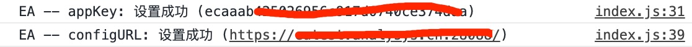
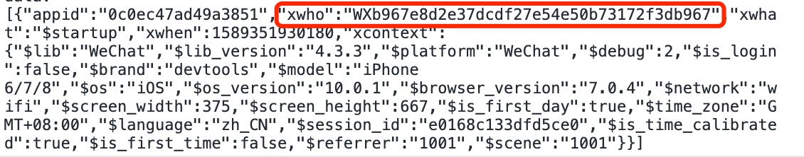

# 微信小程序 SDK

## 一、微信小程序  简介

易达系统是易观基于方舟平台一款触达用户的产品，加强了产品的用户体验和提升了产品的转化率，易达的小程序  SDK 提供了：

* 提供触达用户的弹窗功能，支持弹窗样式：
* 图片样式，支持点击事件。
* 图文混合样式，最上面是图片，下面是标题、正文、按钮。
* 文本样式，支持标题、正文、两个按钮。

## 二、接入小程序 

1、下载小程序 SDK。


SDK下载地址：[https://github.com/analysys-easyTouch/easy-touch-sdk/releases](https://github.com/analysys-easyTouch/easy-touch-sdk/releases)


2、必要参数配置。

```javascript
import AnalysysAgentModal from './components/index.js'

AnalysysAgentModal.appKey = '/*设置为实际APPKEY*/'//在EA系统中选择要集成的项目，并在项目属性中查看AppKey
AnalysysAgentModal.configURL = '/*设置为实际数据获取地址*/'// 配置您的数据获取地址
```

3、登录微信公众平台，进入配置打开开发设置，到服务器域名配置部分在 **request合法域名** 中添加:  [https://ea.analysys.cn](https://ea.analysys.cn/)。

## 三、使用小程序组件

这里以原生小程序、Taro、mpvue、wepy用为例，其余微信小程序框架可参考对应框架对于小程序原生组件的使用方式。

### 3.1 原生小程序应用

1、在 **app.json** 文件中的 **usingComponents** 属性中引入 组件。

```javascript
"usingComponents": {
    "ans-modal": "/components/modal/index"
}
```

2、在每一个page页面中引入&lt;ans-modal/&gt;组件。\(也可以只在需要弹窗的页面引入弹窗组件即可\)

```javascript
//eg: pages/index/index

<ans-modal />
<view> Hello, This is the index page </view>
```

### 3.2 Taro 应用

1、在每一个page页面的 **config配置项** 里通过 **usingComponents** 属性引入组件（也可以只在需要弹窗的页面引入弹窗组件即可），在 **render 方法** 中使用组件。

```javascript
//eg: pages/index/index.js

class Index extends Component {
    config = {
        navigationBarTitleText: '',
        usingComponents: {
            "ans-modal": "../../common/ea/ansModal/modal/index"
        }
    }
    
    //...more
    
   render() {
      return (
        <View>
          <ans-modal />
        </View>
      )
    }
}
```

### 3.3 mpvue 应用

1、将组件放入static 文件夹中，在 **app.json** 中引入组件。

```javascript
// app.json

"usingComponents": {
  "ans-modal": "../static/ansModal/modal/index"
}
```

2、在每一个渲染的 **template** 中引入 &lt;ans-modal /&gt; 组件。

```javascript
<template>
    <div>
        <ans-modal />
        //...more
    </div>
</template>
```

### 3.4 wepy 应用 

1、将组件放入 **utils** 文件夹中，在每个 **pages** 页面里引入组件。并在每个页面的 template 中引入 &lt;ans-modal/&gt; 组件。

```javascript
// eg: index.wpy

//template
<template>
    <div>
        <ans-modal />
        //...more
    </div>
</template>

//...more

//config
<config>
{
    navigationBarTitleText: 'EA',
    usingComponents: {
      "ans-modal": "../utils/ansModal/modal/index"
    }
}
</config>
```

## 四、上报相关用户属性

通过方舟SDK上报如下的用户属性可以打通绑定在同一开放平台的小程序和公众号。

```javascript
AnalysysAgent.profileSet({
  unionId: '/* 设置为小程序用户的 unionId */',
  openId: '/* 设置为小程序用户的 openId */',
  appId: '* 设置为小程序的 appId */'
})
```

#### 如何获取微信小程序用户的openId 与 unionId ？

#### [https://developers.weixin.qq.com/miniprogram/dev/api-backend/open-api/login/auth.code2Session.html](https://developers.weixin.qq.com/miniprogram/dev/api-backend/open-api/login/auth.code2Session.html)

## 五、接入问题排查

1、怎么查看 appKey 和 configURL 是否配置成功？

集成成功后，可以看到控制台有打印内容，如下:



2、接入成功，没有弹窗？

在方舟用户分群中查看本地的用户是否在配置的弹窗活动用户分群中，如果不存在，将本地用户加入分群中。



## 六、如何支持小程序弹窗跳转到公众号文章

#### 添加四个文件 webView.js、webView.json、webView.wxml、webView.wxss

**webView.js**

```text
  Page({
    data: {
      url: ''
    },
    onLoad(option) {
      option.url && this.setData({
        url: option.url
      })
      wx.setNavigationBarTitle({
        title: '公众号文章'
      })
    }
  })
```

**webView.wxml**

```text
 <view>
     <web-view src="{{url}}"></web-view>
 </view>
```

#### 在app.json中添加对应的路径

例如 pages/webView/webView，保证可以正常访问这个页面

```text
  "pages": [
    "pages/index/index",
    "pages/log/log",
    "pages/home/home",
    "pages/print_photo/index",
    "pages/webView/webView"
  ],
```

#### 在配置sdk的appkey的地方 同时配置publicWebviewUrl 为上面的路径

```text
import AnalysysAgentModal from '../../components/index.js'

AnalysysAgentModal.appKey = '56749d656f408c5254de6af249e0c61a'
AnalysysAgentModal.configURL = 'https://eatest.analysys.cn:28088/'
// 如果需要跳转公众号功能的话 需要配置一个页面容器
AnalysysAgentModal.publicWebviewUrl = '/pages/webView/webView'
```

#### 


