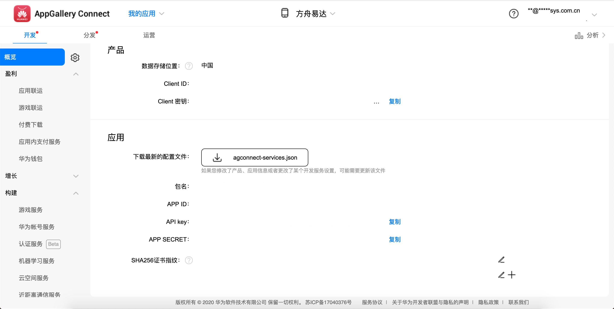

# 易达系统集成文档

## 一.综述

易达系统搭建起产品与用户之间互动的桥梁，提供多样的可靠的触达用户的通道，提升了产品的用户体验并提高用户的转化率。

### 二.系统简述

#### 1、业务架构

描述： 易达系统是基于方舟平台强大的数据处理能力，提供基于用户分群和打点事件的触达通道。 易达系统从方舟平台获取已经创建的用户分群信息， 提供的通道如下： 1. APP内的弹窗，可以支持图片、图文混合、文本等样式。 2. PUSH推送通道、可以支持现在市面上主流的华为、小米、OPPO等厂商通道。 3. 邮件推送。 4. 短信通知、智慧短信通知。 5. 微信公众号的推送。

#### 2、弹窗实现

流程描述： 1. 方舟SDK上报用户事件给方舟平台。 2. 在方舟的平台中创建基于用户分群。 3. 在易达系统中web端创建基于用户事件的活动时，易达系统需要从方舟平台中拉取分群数据和用户事件数据。 4. 易达SDK在启动时候从易达后台拉取全部的弹窗活动列表。 5. 从易达SDK中获取注册监测用户事件接口，并将接口注册到方舟SDK中，用于用户信息同步和用户事件触发。 6. 方舟SDK 在有用户事件产生的时候通知易达SDK。 7. 易达SDK根据拉取的弹窗活动和方舟SDK的通知的事件进行对比，符合触发条件执行相应的弹窗。

#### 3、用户事件触发PUSH实现

流程描述： 1. 方舟SDK上报用户事件给方舟平台。 2. 在方舟的平台中创建基于用户的分群信息。 3. 在易达系统中创建基于用户事件的PUSH推送活动时，易达系统需要从方舟平台中拉取分群数据和用户事件数据。 4. 易达SDK在启动时候从易达后台拉取订阅的用户事件列表。 5. 从易达SDK中获取注册监测用户事件接口，并将接口注册到方舟SDK中，用于用户信息同步和用户事件触发。 6. 方舟SDK 在有用户事件产生的时候通知易达SDK。 7. 易达SDK根据订阅事件列表和方舟SDK的通知的事件进行对比，符合订阅条件执行上报易达服务的流程。

### 三.系统集成流程

#### 1、更新方舟系统

更新方舟系统，以便于可以可以通过接口访问获取到用户事件信息和分群信息等接口， 请提供现有的方舟系统的版本号，便于我们核实系统是否支持。最新方舟系统是4.5.0版本。

#### 2、更新方舟SDK

更新方舟的SDK，以便于可以注册事件的监听，请提供现有的使用的方舟SDK的版本。

#### 3、开通易达账号

请联系的我们的售前人员，让他帮你i开通易达系统。

#### 4、集成易达SDK

集成我们的移动端的SDK，SDK的接入请参照SDK的接口文档。

#### 5、易达系统配置

* 配置方舟账号

当开通易达系统，请创建相应的项目，并在项目的系统配置中，配置方舟系统的账号信息， 以便于我们访问方舟系统。

* 配置PUSH账号

请开通华为、小米、OPPO等PUSH通道，厂商的PUSH的到达率相比第三方的PUSH到达率要更高，这样才能保证 触达用户的效果。

* 配置短信账号

请配置第三方的短信平台的账号配置信息

### 四.厂商通道的账号配置

#### 1、华为推送

* 登录[华为开发者平台](https://developer.huawei.com/consumer/cn/console#/serviceCards/);
* 点击开发服务中的push模块；进入应用列表
* 点击应用列表中的应用（方舟项目的上报应用），查看开发列表，如下图：



#### 2、小米推送

* 登录[小米开发者平台](https://dev.mi.com/console/appservice/push.html)
* 在应用服务列表中选中消息推送功能；
* 在**应用列表**中点击相应的应用中的**应用信息**；会应用的相应的推送信息；

