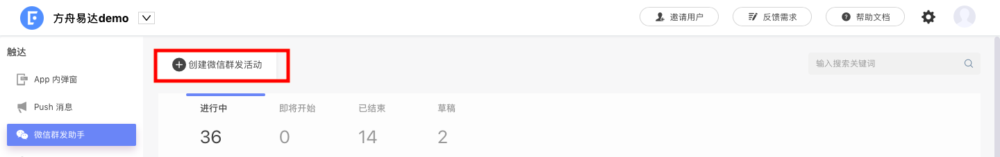
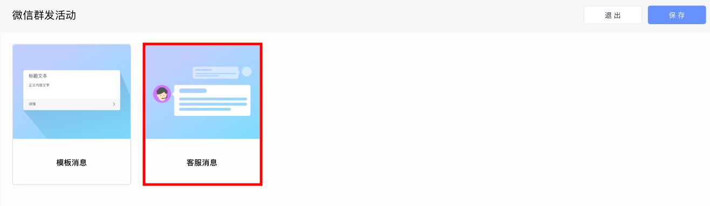
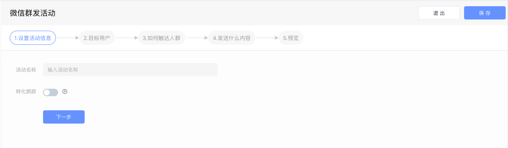
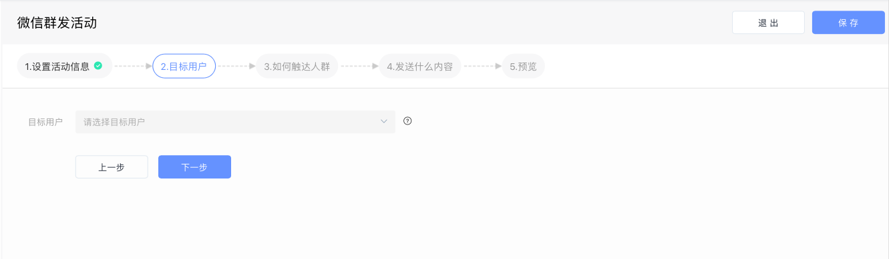
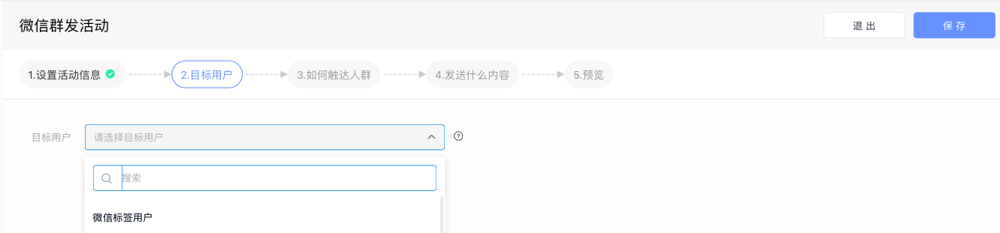
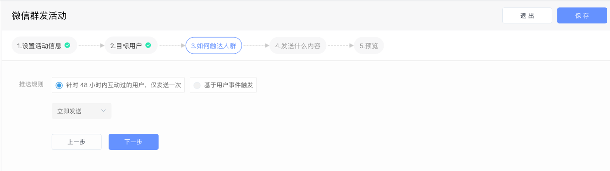
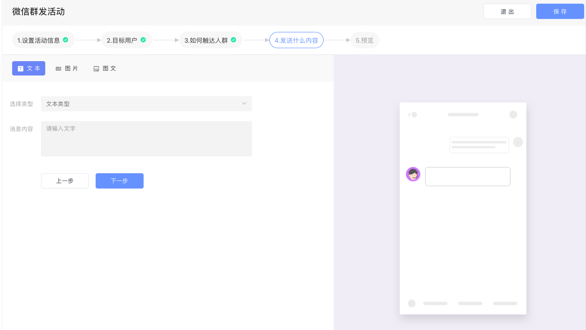

# 创建微信客服消息活动

## 一、进入活动创建页面

点击左侧活动列表中的“微信群发助手”，进入微信活动页面，点击“创建微信群发活动”按钮后进入活动创建页面。

点击“客服消息”选项，进入微信客服消息活动创建页面，选择需要发布活动的公众号后，开始创建活动。

## 二、设置活动消息

填写活动名称以及是否开启转化跟踪功能。

## 三、选择目标人群

通过下拉菜单选择本次微信客服消息活动将要触达的人群。EA已经完成了和微信的数据同步，可以直接在下拉菜单中选择微信标签用户。

同时，微信客服消息活动支持来自用户行为分析系统的分群选择。

## 四、设置活动的触发条件

通过设置好的触发条件，当用户满足条件时，系统自动触发活动并将微信客服消息推送给用户。

* 针对48小时内互动过的用户，仅发送一次：针对48小时内互动过的活跃粉丝，发送一次客服消息。

        具体互动动作列表如下：

        用户发送信息、点击自定义菜单、关注公众号、扫描二维码、支付成功

* 基于用户事件触发：每次触发设定的事件时，都会向用户发送微信模板消息。

        触发事件列表如下：

        1）主动发送消息给公众号

        2）点击公众号菜单栏

        3）关注公众号

同时，微信客服消息活动支持分时间发送：

1. 立即发送：活动开始执行后，立即向用户发送微信模板消息
2. 延时发送：达到设定的时间后，才会向用户发送微信模版消息

## 五、选择消息模版并填写消息内容

* 文本模版：纯文本消息。

        可以在下拉菜单中选择发送：

        1）文字消息。不支持跳转到其他页面。

        2）跳转至落地页。填写消息内容并配置跳转地址，用户点击后可到达指  

               定落地页。

        3）跳转至小程序。填写消息内容，获取小程序appid和小程序路径，并填

               写跳转地址，用户点击后可到达指定小程序页面。

* 图片模版：纯图片消息。不支持跳转至其他页面。 
* 图文模版：在图片的基础上增加了文字描述，用户点击后可跳转至指定落地页或图文信息页。

        1）跳转至落地页。 输入标题和文字内容并配置封面图片的URL，同时配

              置跳转页面的URL。 用户点击卡片可以跳转至指定落地页。

        2）跳转至图文消息页。在下拉菜单中选择将要跳转的图文信息，下拉菜

              单中的选项可以在微信后台创建。用户点击卡片可以跳转至指定图文 

              信息页。

## 六、预览并执行

预览并执行活动，活动正式运行，状态由“草稿”变为“进行中”。

