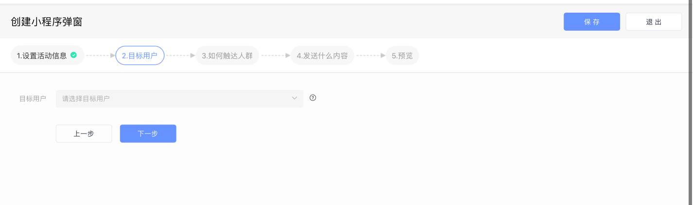
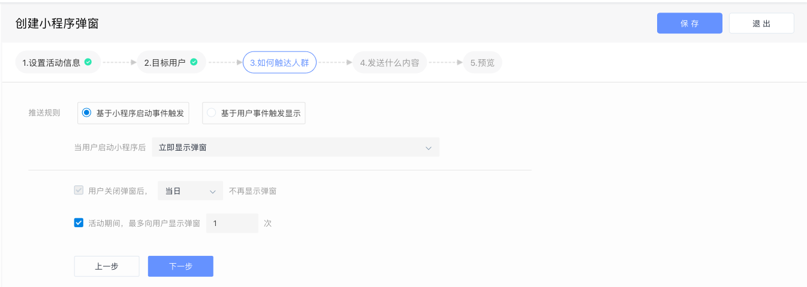
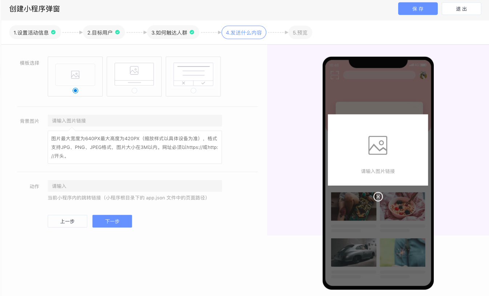

# 创建微信小程序活动

在接入小程序之前，需先完成小程序的相关设置。

点击按钮进入小程序配置指南界面，完成相关配置。

## 一、设置活动消息

填写活动名称、活动周期以及是否开启转化跟踪功能。

## 二、选择目标人群

通过下拉菜单选择本次小程序弹窗将要触达的人群，这些人群可以来自“用户行为分析系统“、”用户标签系统“、“CDP系统”、“CRM”系统等。

## 三、设置活动的触发条件

通过设置好的触发条件，当用户满足条件时，系统自动触发活动并将小程序弹窗推送给用户。

* 基于小程序启动事件触发：当小程序启动后，弹窗显示在小程序的指定页面内
* 基于用户事件触发：每次触发设定的事件时，都会向用户推送小程序弹窗

同时，APP弹窗支持用户体验相关的设置：

* 可以设定当用户关闭弹窗后，当日或活动期间不再向该用户发送弹窗
* 可以自定义活动期间内，最多向用户显示的弹窗次数

## 四、设置小程序弹窗的内容及样式

选择小程序弹窗样式模板并填写相关内容信息，同时配置小程序弹窗的跳转链接。

小程序弹窗活动支持以下模版：

* 图片模板：填写图片的URL 地址，触发弹窗后，会在小程序内弹出一个图片，用户点击图片可以跳转到指定的落地页。
* 图文模板：在图片的基础上，可以增加一些文字信息，例如活动标题和描述，并配置按钮的跳转链接。用户点击按钮可以跳转到小程序内的其他页面。
* 文本模板：单纯的文本弹窗，用户点击不同的按钮跳转到不同的位置。

## 五、预览并执行

预览并执行活动，活动正式运行，状态由“草稿“变为”进行中“或“即将开始”。

