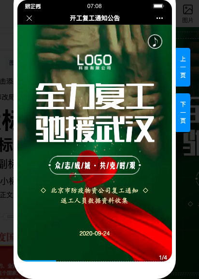
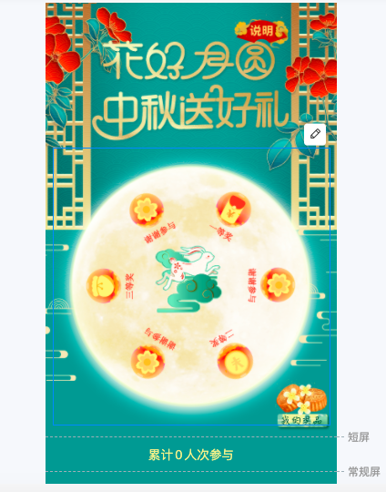

# 内容管理

EA通过接入易企秀开放平台，为用户提供了创建H5活动、表单活动、H5互动活动的功能。

通过获取易企秀对应的接口，用户可以在直接在EA进行以下场景的应用：

### 一、H5 活动

H5 由包含文字、图片、音乐、视频等的页面组成，将不同的控件和动画特效结合在一起，适用于移动端的营销活动展示。用户可以灵活拖拽不同的模块进行自由创作，适合活动邀约、品牌展示、电商促销等活动的投放。

### 二、表单活动

表单活动适用于用户信息的收集。用户可以选择不同的模版进行创作，也可以新建空白表单活动。针对不同的需求，提供了多种题型和样式，用户数据轻松收集。

### 三、H5 互动活动

H5 互动活动通过与用户互动的方式，达到广告营销的目的。适用于线下营销、广告营销、品牌传播。用户可以线下扫码参与抽奖， 也可以通过线上传播渠道参与活动。通过简单有效的互动方式，低成本获客，增强用户粘性。

