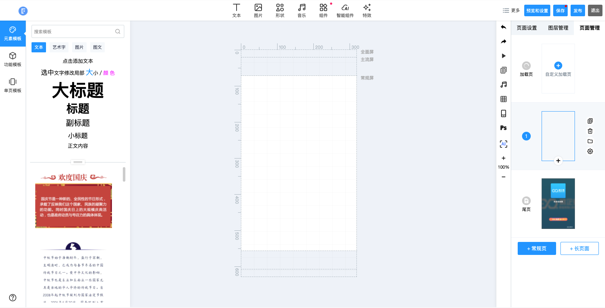

# H5编辑器

## 一、进入H5活动列表

点击左侧“H5编辑器“按钮，进入H5活动列表页，查看和新建H5活动。

支持筛选查看不同类型的H5 活动。

## 二、新建H5活动

点击进入活动新建页面，点击“空白创建“创建新活动，或者选择模版后创建新活动。

## 三、设置活动内容

## 四、预览并发布

预览并发布活动，活动正式运行，状态由“创建中”变为“已发布”。

发布成功后会生成链接，支持复制成为App弹窗的落地页链接，用户点击即可跳转至该H5页面。

