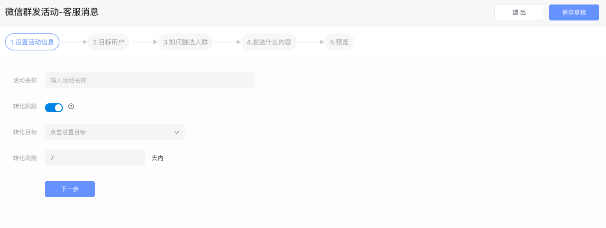
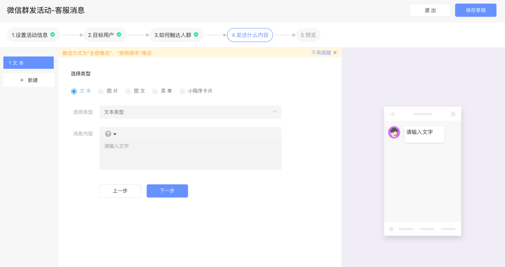
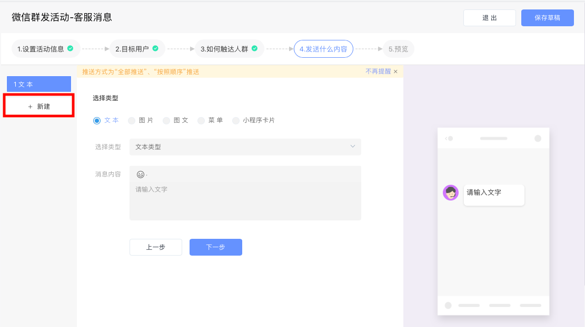
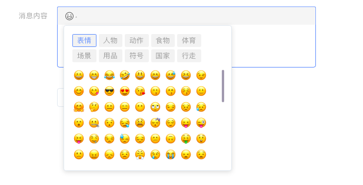

# 创建微信客服消息活动

## 一、进入活动创建页面

点击左侧活动列表中的“微信群发助手”，进入微信活动页面，点击“创建微信群发活动”按钮后进入活动创建页面。

点击“客服消息”选项，进入微信客服消息活动创建页面，选择需要发布活动的公众号后，开始创建活动。

## 二、设置活动信息

填写活动名称以及是否开启转化跟踪功能。

## 三、选择目标人群

通过下拉菜单选择本次微信客服消息活动将要触达的人群，这些人群可以来自“用户行为分析系统”、“用户标签系统”、“CDP 系统”、“CRM 系统”等。

点击“添加分群“按钮可同时设置多个目标人群。

同时，EA 已经同微信完成数据同步，可以直接在目标人群中选择微信标签用户。

## 四、设置活动的触发条件

通过设置好的触发条件，当用户满足条件时，系统自动触发活动并将微信客服消息推送给用户。

* 针对48小时内互动过的用户，仅发送一次：针对48小时内互动过的活跃粉丝，发送一次客服消息。

        具体互动动作列表如下：

        用户发送信息、点击自定义菜单、关注公众号、扫描二维码、支付成功

* 基于用户事件触发：每次触发设定的事件时，都会向用户发送微信模板消息。

        触发事件列表如下：

        1）主动发送消息给公众号

        2）点击公众号菜单栏

        3）关注公众号

同时，微信客服消息活动支持分时间发送：

1. 立即发送：活动开始执行后，立即向用户发送微信模板消息
2. 延时发送：达到设定的时间后，才会向用户发送微信模版消息

## 五、选择消息模版并填写消息内容

* 文本消息：纯文本消息。

        可以在下拉菜单中选择发送：

        1）文字消息。不支持跳转到其他页面。

        2）跳转至落地页。填写消息内容并配置跳转地址，用户点击后可到达指  

               定落地页。

        3）跳转至小程序。填写消息内容，获取小程序appid和小程序路径，并填

               写跳转地址，用户点击后可到达指定小程序页面。

* 图片消息：纯图片消息。不支持跳转至其他页面。 
* 图文消息：在图片的基础上增加了文字描述，用户点击后可跳转至指定落地页或图文信息页。（用户每次同公众号进行互动，最多只能发送 1 条图文消息）

        1）跳转至落地页。 输入标题和文字内容并配置封面图片的URL，同时配

              置跳转页面的URL。 用户点击卡片可以跳转至指定落地页。

        2）跳转至图文消息页。在下拉菜单中选择将要跳转的图文信息，下拉菜

              单中的选项可以在微信后台创建。用户点击卡片可以跳转至指定图文 

              信息页。

* 菜单消息：在文字的基础上增加了按钮用户点击按钮后，可以发送给用户以下信息：

        1）文本消息：见上方文本消息详情

        2）图片消息：见上方图片消息详情

        3）图文消息：见上方图文消息详情

        4）小程序卡片消息：见下方小程序卡片消息详情

* 小程序卡片消息：由图片和标题组成的小程序卡片。

        填写消息内容，获取小程序appid和小程序路径，并填写跳转地址，用户 

        点击后可到达指定小程序页面。

同时，上述五种消息模版支持组合发送，在 “发送什么内容” 页面左侧点击 “新建” 按钮即可进行设置。默认所有客服消息按顺序全部发送。

上述功能中的文字信息模块均支持添加emoji表情，在消息编辑框上方进行选择即可添加。

## 六、预览并执行

预览并执行活动，活动正式运行，状态由“草稿”变为“进行中”。

