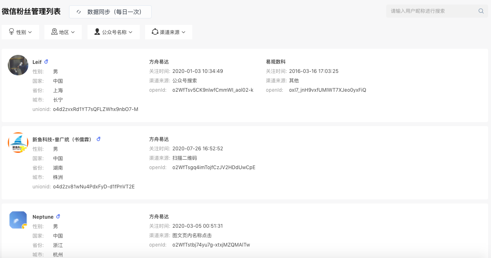
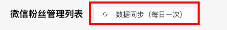

# 微信粉丝管理

通过EA的微信粉丝管理功能，可以快速查看公众号的关注者列表，实现多个公众号之间的粉丝数据同步。

完成公众号对EA的授权后，管理员登录EA后台可查看以下用户信息：

* 头像
* 昵称
* 性别
* 国家
* 省份
* 城市
* 关注公众号事件
* 关注渠道来源
* 与公众号对应的OpenID
* 用户的UnionID

可以根据用户的性别、地区、关注的公众号名称、来源渠道进行筛选搜索。

同时，EA支持数据同步功能。点击“数据同步”按钮，可获取公众号最近更新的关注者列表。该功能每天可使用一次。

### 粉丝管理功能实现机制

当关注者和公众号产生消息交互后，公众号可获得关注者的OpenID，通过调用接口来根据OpenID获取用户基本信息，包括昵称、头像、性别、所在城市、语言和关注时间（获取用户信息需用户授权）。公众号还可以通过调用接口来获取帐号的关注者列表，关注者列表由一串OpenID组成。当公众号对EA进行授权后，EA获得了该公众号的用户管理权限，可以将上述用户信息统一展示在EA后台。

当用户在使用同一个微信开放平台下的不同应用时，会拥有一个UnionID。针对同一微信平台的不同应用，该UnionID是唯一的。UnionID可以实现多个公众号之间，以及PC端和移动端之间的粉丝数据打通。

当多个公众号关联到同一个微信开放平台时，可以通过API接口获取全部的公众号粉丝列表，同时计算这些用户的UnionID，实现同一用户关注多个公众号时的统一管理。开发者可以在EA后台查看该用户关注的同一开放平台下的所有公众号。

OpenID、UnionID参考：[https://developers.weixin.qq.com/doc/offiaccount/User\_Management/Get\_users\_basic\_information\_UnionID.html\#UinonId](https://developers.weixin.qq.com/doc/offiaccount/User_Management/Get_users_basic_information_UnionID.html#UinonId)

