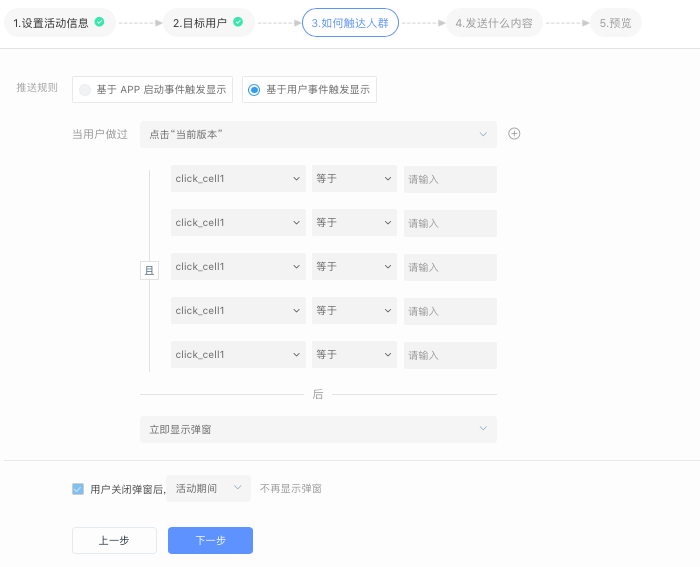
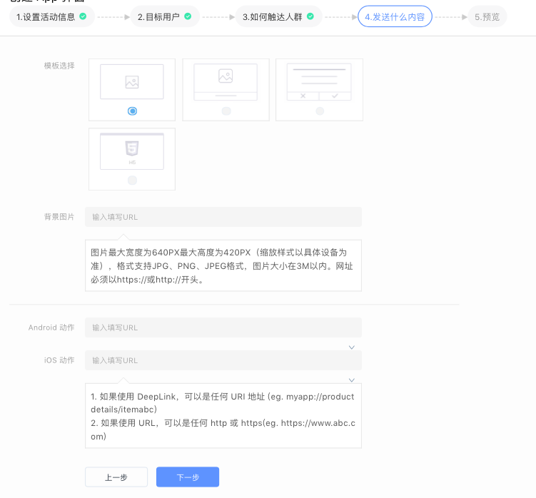

# 创建 App 弹窗活动

### 一、设置活动信息

填写活动名称、活动有效期以及是否开启转化跟踪功能。

### 二、选择目标人群

通过下拉菜单选择本次 App 弹窗活动将要触达的人群，这些人群可以来自“用户行为分析系统”、“用户标签系统”、“CDP 系统”、“CRM 系统”等。

### 三、设置活动的触发条件

通过设置好的触发条件，当用户满足条件时，系统自动触发活动并将 App 弹窗推送给用户。

* 基于 App 启动事件触发：在 App 启动后，弹窗可以立即弹出或在指定的 App 内页面弹出
* 基于用户行为触发：每次触发设定的事件时，弹窗立即显示在当前页面或者后续指定的 App 内页面（用户最多可以同时添加6个行为属性）

同时，App 弹窗支持用户体验相关的设置：

* 当用户关闭弹窗后，可以在活动期间都不再显示弹窗或者当日不再显示弹窗
* 可以在活动期间，不限制弹窗显示次数，弹窗会在活动结束后停止弹出
* 可以填写最大弹窗次数：在活动期间内，达到设置的数值时，不再向用户显示弹窗

### 四、设置 App 弹窗的内容及样式

选择 App 样式模板并填写相关内容信息：

* 图片模板：填写图片的 URL 地址，触发弹窗后，会在 App 内弹出一个图片，用户点击图片可以跳转到指定的落地页
* 图文模板：相比图片模板，额外可以增加一些文字信息，例如活动标题和描述
* 文本模板：单纯的文本弹窗，支持点击不同的按钮跳转到不同的位置
* H5模板：填写H5页面的URL地址，触发弹窗后，会弹出一个包含H5页面的弹窗，用户可以弹窗内进行一系列的操作


如何正确填写弹窗的跳转地址？

如果使用 DeepLink ，需要 App 本身已经能够支持 DeepLink 跳转链接，可以是任何 URI 地址 \(eg. myapp://productdetails/itemabc\)

如果使用 URL，可以是任何 http 或 https\(eg. https://www.abc.com\)


### 五、预览并执行

预览并执行活动，活动正式运行，状态由“草稿”变为“进行中”或“即将开始”。

