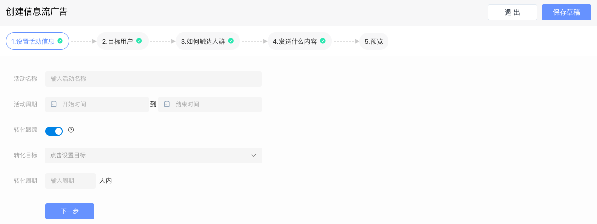
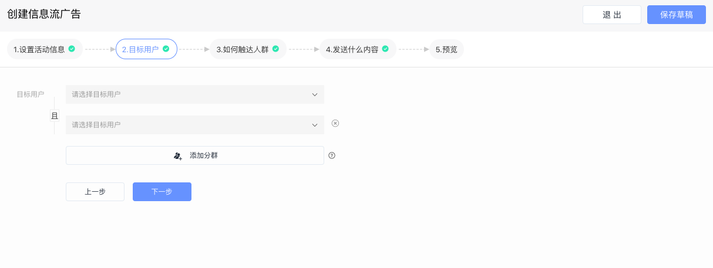
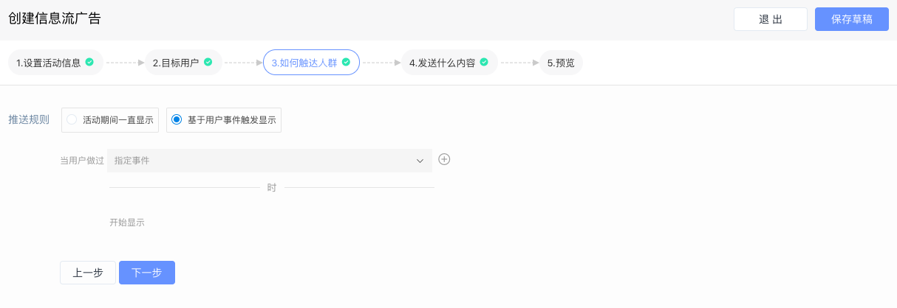
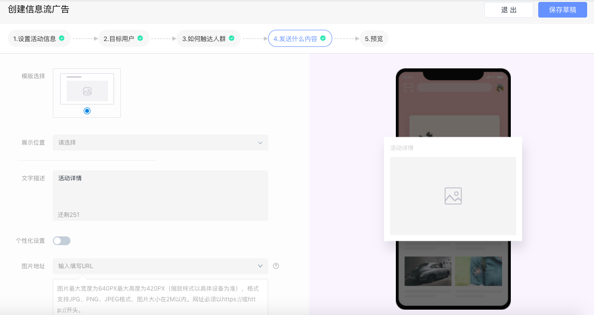
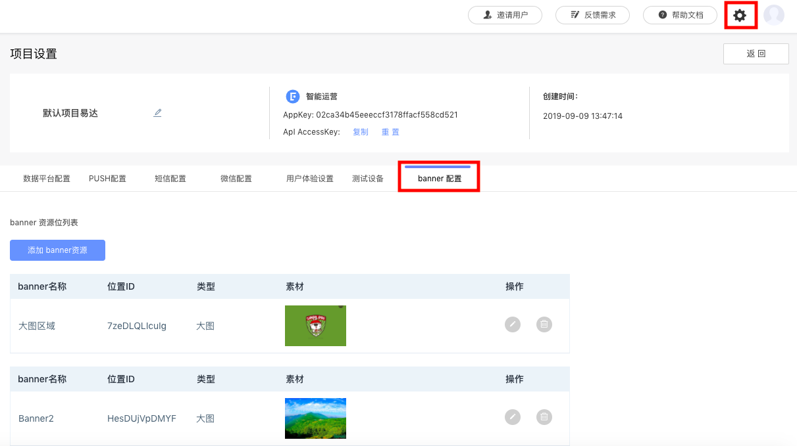

# 创建信息流广告活动

## 一、设置活动信息

填写活动名称、活动有效期以及是否开启转化跟踪功能。

## 二、选择目标人群

通过下拉菜单选择本次活动将要触达的人群，这些人群可以来自“用户行为分析系统”、“用户标签系统”、“CDP 系统”、“CRM 系统”等。

点击“添加分群“按钮可同时设置多个目标人群。

## 三、设置活动的触发条件

* 活动期间一直显示：用户使用App期间一直显示。
* 基于用户事件触发显示：当用户做过指定事件后，开始显示。

## 四、设置信息流广告内容

选择模版和展示位置，并添加文字描述。配置图片地址和用户点击后的跳转链接。

点击“个性化设置“按钮可以对字体颜色和对齐方式进行修改。

点击“设置“按钮后，进入系统设置界面，点击“添加banner资源“按钮，可以添加默认图片。当活动配置的图片无法显示时，显示已设置的默认图片。

## 五、预览并执行

预览并执行活动，活动正式运行，状态由“草稿”变为“进行中”或“即将开始”。

