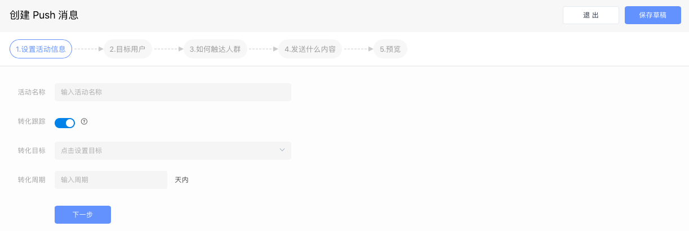
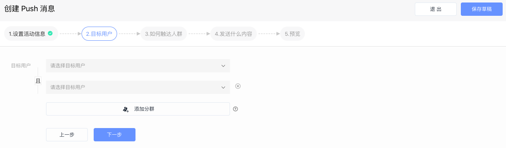
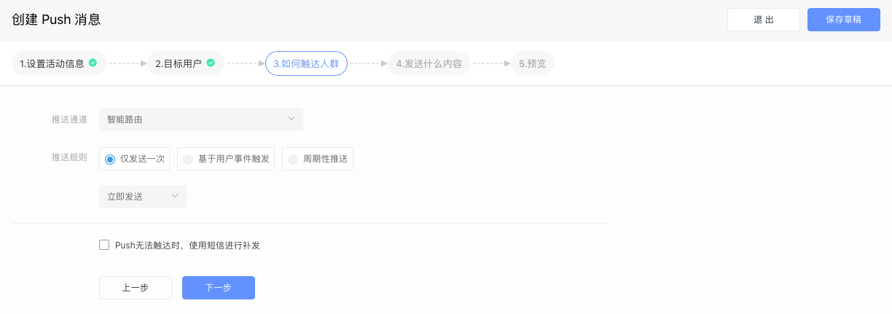
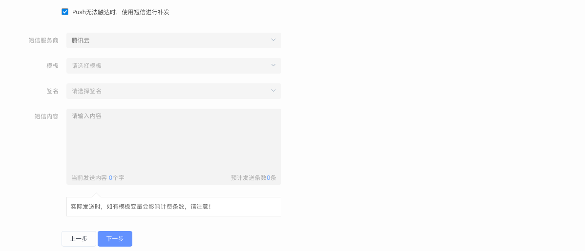
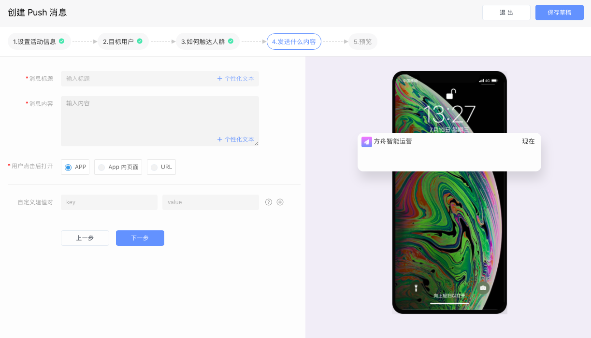

# 创建 Push 消息活动

### 一、设置活动信息

填写活动名称以及是否开启转化跟踪功能。

### 二、选择目标人群

通过下拉菜单选择本次 Push 消息活动将要触达的人群，这些人群可以来自“用户行为分析系统”、“用户标签系统”、“CDP 系统”、“CRM 系统”等。

点击“添加分群“按钮可同时设置多个目标人群。

### 三、设置活动的触发条件

通过设置好的触发条件，当用户满足条件时，系统自动触发活动并将 Push 消息推送给用户。

* 仅发送一次：只会向用户发送一次 Push 消息
* 基于用户事件触发：每次触发设定的事件时，都会向用户发送 Push 消息
* 周期性推送：以周期性的频率向用户发送push消息

同时，Push 消息活动支持定时发送：

* 立即发送：活动开始执行后，立即向用户发送 Push 消息
* 延时发送：达到设定的时间后，才会向用户发送 Push 消息

Push 消息无法触达时，支持短信补发：对于消息下发失败或用户已经卸载 App 的情况，能够自动通过短信补发消息内容，保证用户可以收到活动通知。

* 通过下拉菜单选择补发本次push消息活动的短信服务商，模版和签名，以及输入短信内容。


什么是智能路由？

智能路由是 EA 产品的特有功能，是 EA 智能化的体现。用户选择智能路由后，无需关心 Push 发送时使用的厂商通道，EA 根据用户当前机型自动进行判断，选择对应的厂商通道进行发送，保证极高到达率。


### 四、设置 Push 消息内容

填写 Push 消息的标题和内容，以及用户点击 Push 消息后触发的操作：

* 点击后打开 App：用户点击 Push 消息后，直接拉起 App 并启动
* App 内页面：用户点击 Push 消息后，拉起 App 并在启动后直接进入落地页
* URL：用户点击 Push 消息后，拉起内置默认浏览器并进入落地页


如何正确填写 App 内页面地址？

目前 EA 支持 2 类页面地址表达方式：

1. 页面原始地址：

   Android：com.analysys.easytouch.FeedbackActivity

   iOS：EAMineController

2. DeepLink：analysys://android/open\_webview?url=https://ark.analysys.cn

使用 DeepLink 时，需要 App 本身已经能够支持 DeepLink 跳转链接。


### 五、预览并执行

预览并执行活动，活动正式运行，状态由“草稿”变为“进行中”或“即将开始”。



