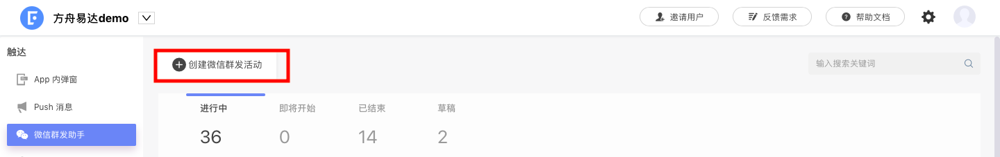
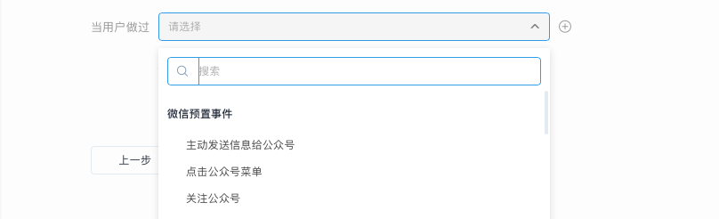

# 创建微信模板消息活动


微信目前只对服务号开通了模板消息触达能力，因此 EA 产品的微信活动仅对服务号生效。


## 一、进入活动创建页面

点击左侧活动列表中的“微信群发助手”，进入微信活动页面，点击“创建微信群发活动”按钮后进入活动创建页面。

点击“模版消息”选项，进入微信模版消息活动创建页面，开始创建活动。

### 二、设置活动信息

填写活动名称以及是否开启转化跟踪功能。

### 三、选择目标人群

通过下拉菜单选择本次微信模板消息活动将要触达的人群，这些人群可以来自“用户行为分析系统”、“用户标签系统”、“CDP 系统”、“CRM 系统”等。

点击“添加分群“按钮可同时设置多个目标人群。

同时，EA 已经同微信完成数据同步，可以直接在目标人群中选择微信标签用户。

### 四、设置活动的触发条件

通过设置好的触发条件，当用户满足条件时，系统自动触发活动并将微信模板消息推送给用户。

* 仅发送一次：只会向用户发送一次微信模板消息
* 基于用户行为触发：每次触发设定的事件时，都会向用户发送微信模板消息

在使用基于用户事件触发的消息功能时，EA支持微信预置事件的选择。微信预置事件包括：主动发消息给公众号、点击公众号菜单、关注公众号。在下拉菜单中即可进行选择。

同时，微信模板消息活动支持定时发送：

* 立即发送：活动开始执行后，立即向用户发送微信模板消息
* 延时发送：达到设定的时间后，才会向用户发送微信模板消息

### 五、选择消息模板并填写消息内容

选择将要使用的消息模板并填写消息内容，同时配置点击消息卡片后的跳转位置：

* URL：用户点击消息卡片后，将在微信内置浏览器打开落地页
* 小程序：用户点击消息卡片后，将直接打开对应的小程序

### 六、预览并执行

预览并执行活动，活动正式运行，状态由“草稿”变为“进行中”或“即将开始”。



