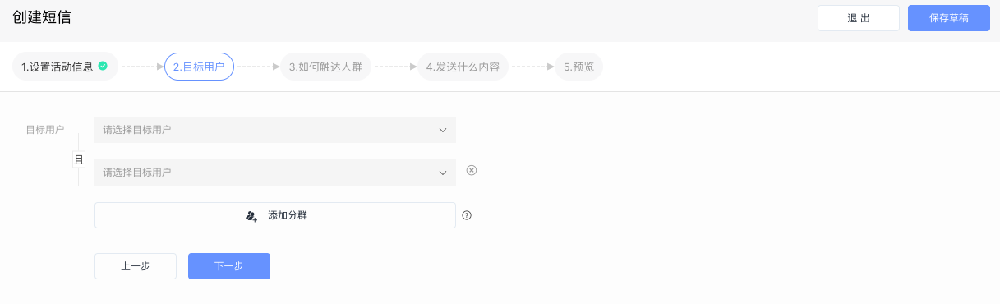

# 创建短信活动

### 一、设置活动信息

填写活动名称以及是否开启转化跟踪功能。

### 二、选择目标人群

通过下拉菜单选择本次短信活动将要触达的人群，这些人群可以来自“用户行为分析系统”、“用户标签系统”、“CDP 系统”、“CRM 系统”等。

点击“添加分群“按钮可同时设置多个目标人群。

### 三、设置活动的触发条件

通过设置好的触发条件，当用户满足条件时，系统自动触发活动并将短信推送给用户。

* 仅发送一次：只会向用户发送一次短信
* 基于用户行为触发：每次触发设定的事件时，都会向用户发送短信
* 周期性推送：

可以设置在一段活动周期内，每日/周/月固定日期重复发送，也可以选择固定日期不发送。

同时，短信活动支持定时发送：

* 立即发送：活动开始执行后，立即向用户发送短信
* 延时发送：达到设定的时间后，才会向用户发送短信

### 四、设置短信内容

如果同时对接了多家短信服务商，请先选择本次活动使用的短信服务商，然后选择对应的短信模板和短信签名，之后填写本次活动的短信内容。


EA 目前只会同步在短信服务商处审核通过的模板和签名。


### 五、预览并执行

预览并执行活动，活动正式运行，状态由“草稿”变为“进行中”或“即将开始”。

