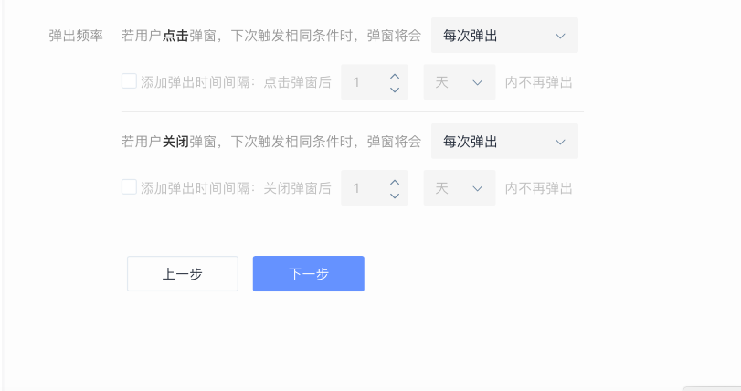
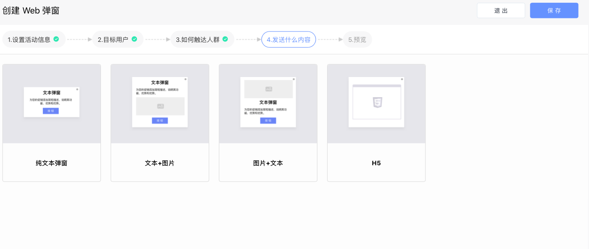

# 创建 web 弹窗活动

### 一、设置活动信息

填写活动名称、活动有效期以及是否开启转化跟踪功能。

### 二、选择目标人群

通过下拉菜单选择本次 App 弹窗活动将要触达的人群，这些人群可以来自“用户行为分析系统”、“用户标签系统”、“CDP 系统”、“CRM 系统”等。

点击“添加分群“按钮可同时设置多个目标分群。

### 三、设置活动的触发条件

通过设置好的触发条件，当用户满足条件时，系统自动触发活动并将 web 弹窗推送给用户。

* 基于用户浏览事件触发：在用户浏览到某个页面时，弹窗显示在该页面
* 基于用户行为事件触发：每次触发设定的事件时，弹窗立即显示在当前页面或者后续指定的页面

同时，web 弹窗支持用户体验相关的设置：

* 点击/关闭弹窗后不再弹出：

        当用户点击/关闭弹窗后，活动期间不再向该用户显示此弹窗。

* 点击/关闭弹窗后限制次数弹出：

        1）设置弹出次数上限：针对用户的点击/关闭弹窗行为，分别设置弹出次

              数上限。在活动期间内，达到设置的数值时，不再向用户显示弹窗。

        2）设置弹出时间间隔：针对用户的点击/关闭弹窗行为，分别设置X天/小 

              时内不再弹出。在活动期间内，仅当超过该时间间隔且用户满足触  

              发条件时，才会再次弹出弹窗。

* 点击/关闭弹窗后每次弹出：

        针对用户的点击/关闭弹窗行为，分别设置是否每次都弹出弹窗。当设置  

        每次都弹出弹窗时，可继续设置弹出时间间隔。在活动期间内，仅当超过

        该时间间隔且用户满足触发条件时，才会再次弹出弹窗。

##        四、设置 web 弹窗的内容及样式

web弹窗支持四种模版选择：纯文本弹窗、文本+图片弹窗、图片+文本弹窗、H5弹窗。

用户可以选择 web 样式模板并填写相关内容信息：

* 纯文本模版：

选择弹窗位置和大小，填写文本内容和按钮文字，并配置点击按钮的跳转地址。用户点击按钮可以跳转到指定页面。

* 文本+图片模板（文本位于图片上方）：

选择弹窗位置和大小，填写文本内容、图片地址和按钮文字，并配置点击图片和按钮的跳转地址。用户点击图片或按钮可以跳转到指定页面。

* 图片+文本模版（图片位于文本上方）：

选择弹窗位置和大小，添加图片、文本内容和按钮文字，并配置点击图片和按钮的跳转地址。用户点击图片或按钮可以跳转到指定页面。

在图片和文本的组合模版中，图片上传支持URL和本地上传，本地上传图片完成后可直接在下拉菜单中选择添加。点击图片元素进入图片设置页面即可进行上传。

* H5模版：

填写图片地址，用户点击图片可以跳转到指定落地页。

同时，Web模版支持个性化设置：

1. 整体布局设置：

点击“更多”按钮，进入整体设置界面，可以进行以下设置：

* 设置弹窗的背景颜色和背景图片
* 设置弹窗的圆角弧度和阴影
* 设置关闭弹窗按钮的位置、样式和大小
* 设置元素的上下、左右边距

2. 元素个性化设置：

可以设置文字的大小和样式、图片的对齐方式、背景颜色、上下边距，按钮文字的颜色、大小和样式。点击元素进入设置页面即可进行修改。

3. 添加或删除元素

点击“删除”图标，删除元素。点击“添加元素”图标，添加元素。H5模版暂不支持添加和删除元素。

### 五、预览并执行

预览并执行活动，活动正式运行，状态由“草稿”变为“进行中”或“即将开始”。

