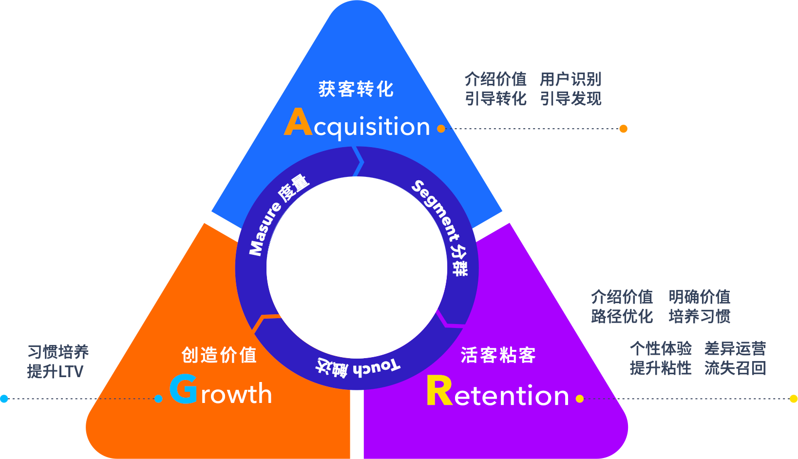

# 自动化工作流

通过 EA 的自动化工作流（workflow）功能，可以将已经验证有效的用户运营策略长期沉淀下来，被创建为 workflow 的活动，系统将会自动判断活动中的各个节点状态，并根据预设的触发条件来运行下一步将要执行的动作。

借助 workflow 功能，可以管理用户生命周期的各个阶段，针对不同用户群体设计不同阶段的运营策略并自动执行，例如：针对新用户的激励策略、召回潜在流失用户的策略、刺激老用户产生复购的返利策略等等，它们都是需要跨越很长时间周期的运营活动，并非短期或一次性的促销、领劵等运营活动。因此需要使用 workflow 来设计更加复杂和多面的用户运营策略。

