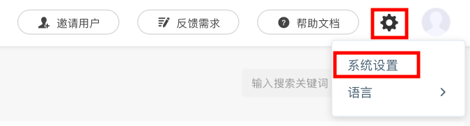
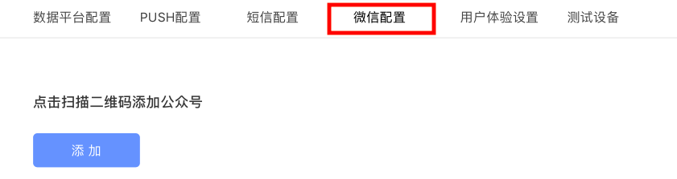

# 扫码绑定微信

授权方式：认证公众号扫码授权接入。

## 一、进入设置界面

用户登录完成后，点击右上角“设置”图标，点击“系统设置”进入设置页面。

## 二、进入扫码界面

点击”微信配置“进入配置页面后，点击”添加“按钮，显示链接后，点击链接跳转到微信公众号授权页面。

## 三、扫码授权

管理员用手机扫描页面上的二维码，手机页面跳转到公众号列表页，选择要授权的公众号。选择授权公众号全部接口，确保消息推送功能全部实现。

申请的权限集包括：

| 权限 | 说明 |
| :--- | :--- |
| 消息管理权限 | 帮助公众号接收用户消息，进行人工客服回复或自动回复 |
| 自定义菜单权限 | 帮助公众号使用自定义菜单 |
| 网页服务权限 | 帮助公众号实现第三方网页服务和活动 |
| 群发与通知权限 | 帮助公众号进行群发和模板消息业务通知 |
| 用户管理权限 | 帮助公众号获取用户信息，进行用户管理 |
| 帐号服务权限 | 帮助认证、设置公众号，进行帐号管理 |
| 素材管理权限 | 帮助公众号管理多媒体素材，用于客服等业务 |
| 微信多客服权限 | 帮助公众号使用微信多客服 |
| 微信扫一扫权限 | 帮助公众号使用微信扫一扫 |
| 广告管理权限 | 帮助广告主进行微信广告的投放和管理 |
| 开放平台帐号管理权限 | 帮助公众号绑定开放平台帐号，实现用户身份打通 |
| 服务号对话权限 | 帮助公众号配置对话能力，管理顾问、客户、标签和素材等 |
| 服务平台管理权限 | 帮助公众号管理服务平台上购买的资源 |

